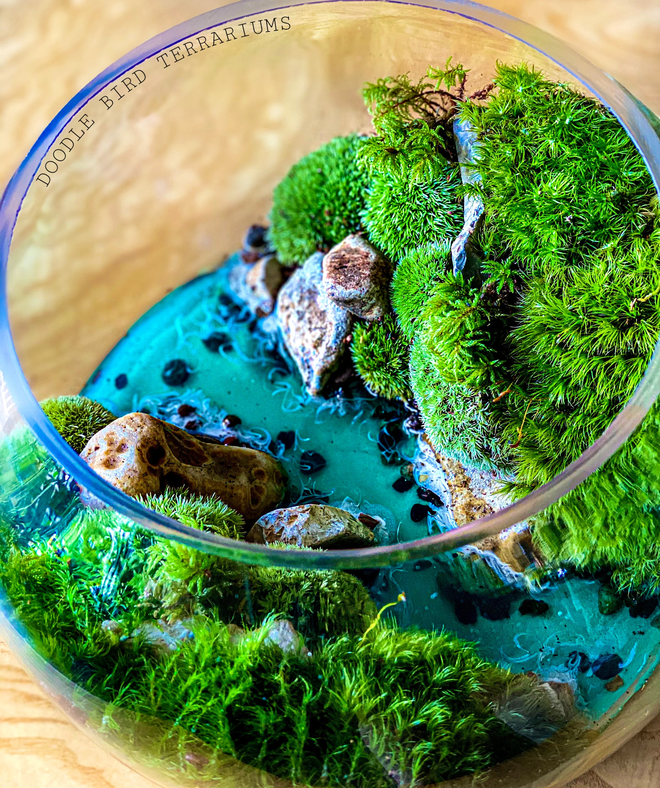

# Terrarium-2023A

## DESCRIPCION
proyecto de la clase de pw orientado a practicar las bases del código HTML,CSS,JS💥💥

## AUTOR

soy un estudiante de la carrera de 6to semetres de la carrera de Ingeneria en Tecnologias de la informacion y Comunicaciones de la pateria de Programacion Web del Instituto Tecnologico de Mexico campus Gustavo A Madero
   

## 📰Notas de Clase
1.HTML
2.CSS
3.JavaScript
